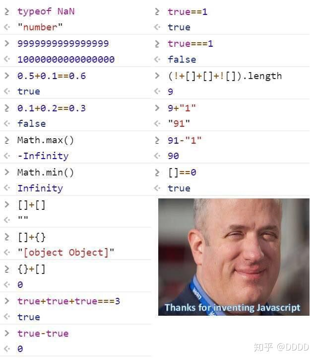

# js类型转换



## **numberToString**

**会将所有进制的数字转化为10进制表示的字符串**

```jsx
console.log(String(11));
console.log(String(0b1111));
console.log(String(0o123));
console.log(String(0xff));
```

**当 Number 绝对值较大或者较小时，字符串表示则是使用科学计数法表示的**

```jsx
**console.log(String(111111111111113435456576));
console.log(String(0.000000011));**
```

## **StringToNumber**

**可以识别二进制、八进制、十进制、十六进制以及科学计数法表示的字符串，将其转换为十进制的数字。**

**如果字符串不是合法的数字则会返回NaN（字符串开始和结尾的空格会被忽略）。**

**字符串长度为0或者全为空格符则返0**

```jsx
**console.log(Number('11'));
console.log(Number(' 0b1111'));
console.log(Number('0o123 '));
console.log(Number(' 0xff '));
console.log(Number('1e4'));
console.log(Number('1e-4'));
console.log(Number('1 1'));
console.log(Number('111&11'));
console.log(Number('11%1'));
console.log(Number(''));
console.log(Number(' '));**
```

## **[拆箱转换](https://www.ecma-international.org/ecma-262/#sec-toprimitive)**

**对象类型到基本类型的转换由ToPrimitive ( input [ , PreferredType ] )方法实现。这个方法的作用就是将input转换成一个非对象类型。**

**参数preferredType是可选的，它的作用是指出input被期待转成的类型。**

**如果不传preferredType进来，默认的是'number'。**

**如果preferredType的值是"string"，那就先执行"toString", 后执行"valueOf"。**

**否则，先执行"valueOf", 后执行"toString"。#### 如果input是基础类型则直接返回值。**

```js
var o = { valueOf: () => { console.log('valueOf'); return {}; }, toString: () => { console.log('toString'); return {}; },};
o[Symbol.toPrimitive] = function () {return 123;}
console.log(Number(o));
console.log(String(o));
```

[类型转换表格](https://www.notion.so/fe75648f1bf647538a4fb4c1b5258a1b)

# **隐式类型转换**

## **加法运算**

- **先进行拆箱转换(默认)得到基础类型**
- **如果任意加数类型为字符串，则将两个加数都转化 为字符串连接起来**
- **将加数转换为number**
- **如果两个加数类型不同则抛错**
- **进行加法计算**

```js
const a = {};
const b = [];
console.log(a + b);
console.log(1 + '1');
console.log(true + '1');
console.log(o + false);
```

## **乘除减运算**

- **将两数转为number**
- **如果两数类型不同则抛错**
- **进行乘除/减法计算**

```jsx
console.log(90 - '1');
console.log(90 * '1');
console.log(1 / '90');
console.log(false - '1');
console.log(undefined - '1');
```

## **==运算**

- **类型相同相当于===比较**
- **null与undefined比较 return true**
- **number与string比较，将string转换为number进行比较**
- **string与bigInt比较，将string转换为bigInt进行比较**
- **boolean和其他类型比较，将boolean类型转换为number**
- **基础类型与object类型比较，对object进行拆箱转换(默认)再比较**
- **number与bigInt比较，数值比较**

```jsx
console.log(null == undefined);
console.log(1 == '12');
console.log(1 == '12');
console.log('12n' == 12n);
console.log(true == '2');
console.log(true == '1');
var o = { valueOf: () => { console.log('valueOf'); return 123; }, toString: () => { console.log('toString'); return {}; },};
console.log(o == '123');
console.log(1 == 1n);
```

 参考: [ECMA Abstract Equality Comparison](https://www.ecma-international.org/ecma-262/#sec-abstract-equality-comparison)